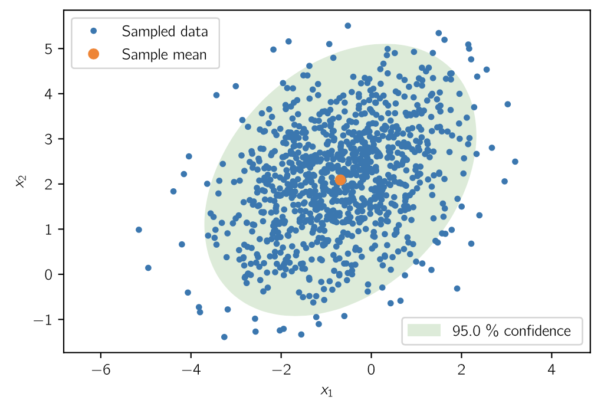

# How to Properly Plot Uncertainty Ellipses for 2D Normally Distributed Data

This notebook demonstrates how to properly plot error ellipses (using Python and [Matplotlib](https://matplotlib.org)) that represent desired levels of uncertainty as given by the covariance matrix of normally distributed data in 2D.  The reason for this note is that I have seen others naively extend 1D covariance bounds to 2D, which is not technically correct.

## Main Files

* [plotting-uncertainty-ellipses.ipynb](plotting-uncertainty-ellipses.ipynb) (Jupyter notebook)

## Sample Output

Here is an example 95 \% confidence ellipse for 1000 sample points.



## References

You can find a similar but partial treatment of this problem on the Matplotlib page called ["Plot a confidence ellipse of a two-dimensional dataset"](https://matplotlib.org/devdocs/gallery/statistics/confidence_ellipse.html). Vincent Spruyt also has a really nice and complete description on his page called ["How to draw a covariance error ellipse?"](https://www.visiondummy.com/2014/04/draw-error-ellipse-representing-covariance-matrix/). We also employ the book Johnson and Wichern (2007) [Applied Multivariate Statistical Anlaysis](https://ocul-qu.primo.exlibrisgroup.com/permalink/01OCUL_QU/11tsvcl/alma9925738833405158) (6th ed.), Chapter 4, Result 4.7 on page 163.

## Cite this Work

You may wish to cite this work in your publications.

> Joshua A. Marshall, How to Properly Plot Uncertainty Ellipses for 2D Normally Distributed Data, _GitHub Repository_, 2020, URL: [https://github.com/bot-doc/plotting-uncertainty-ellipses](https://github.com/bot-doc/plotting-uncertainty-ellipses)

You might also use the BibTeX entry below.

```latex
@misc{Marshall2020,
  author = {Marshall, Joshua A.},
  title = {How to Properly Plot Uncertainty Ellipses for 2D Normally Distributed Data},
  year = {2020},
  publisher = {GitHub},
  journal = {GitHub Repository},
  howpublished = {\url{https://github.com/bot-doc/plotting-uncertainty-ellipses}}
}
```

## License

Source code examples in this notebook are subject to an [MIT License](LICENSE).
